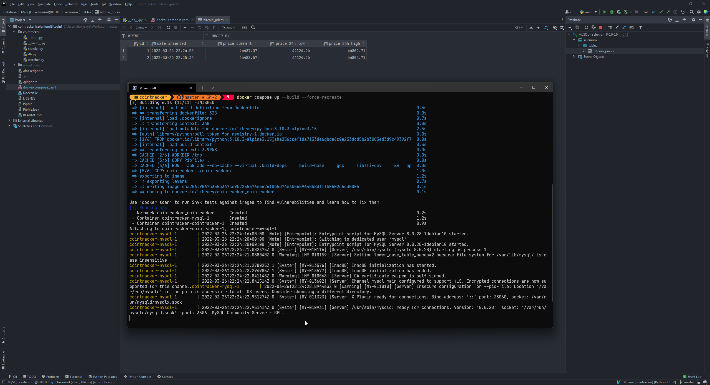

# Cointracker

Cointracker is an overengineered simple homework I had at university.

## The original task

The task was to use selenium to track BitCoin prices and record them in a MySQL database.

What I did instead is I took a generalised approach and wrote much more code than the lecturer asked for, simply because
I can't allow myself to write bad code and hardcode stuff. I try to use all my knowledge and experience to write as
idiomatic Python as possible.

Then I added my enthusiast of DevOps into the project and I dockerised the solution.

## Caveats

* The application isn't fault-tolerant but it's not meant to be run in production either - just some simple homework of
  mine at uni.

* xpaths often change on [coindesk.com](https://coindesk.com) somewhy. So make sure to update `crawler.py` in case
  container shuts down because of an unhandled Selenium exception.

## Running

Rename `example.env` to `.env` and just `docker compose up` it.

